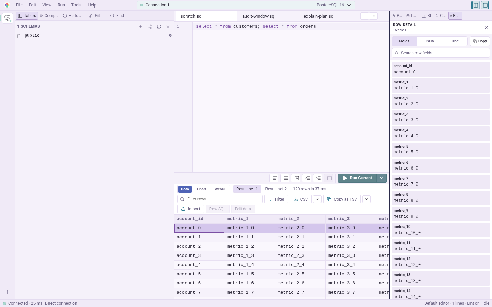

<!-- i18n: language-switcher -->
[English](README.md) | [日本語](README.ja.md)

# Irodori Table

多くのエンジンにまたがるデータのクエリ、閲覧、編集、図示、検証を高速に行うデスクトップデータベースクライアント。

## プレビュー



## インストール

現在のデスクトップ版ダウンロードおよびOS別インストール手順については、以下の公開インストールガイドをご利用ください：

<https://hjosugi.github.io/irodori-docs/install-guide.html>

リリースアセットはGitHub Releasesから公開されています：

<https://github.com/hjosugi/irodori-table/releases>

## 開発

### 5分クイックスタート

1. ご利用のOSに応じたプラットフォームの前提条件をインストールしてください：
   [Windows](https://hjosugi.github.io/irodori-docs/windows-development.html)、
   [macOS](https://hjosugi.github.io/irodori-docs/macos-development.html)、または
   [Linux](https://hjosugi.github.io/irodori-docs/linux-development.html)。
   Linuxユーザーは、デスクトップアプリを実行する前にそのガイドにあるWebKitGTKおよびリンカーパッケージをインストールしてください。
2. リポジトリのルートから依存関係をインストールし、ローカルセットアップを確認します：

   ```sh
   make setup
   make doctor
   ```

3. デスクトップ開発用シェルを起動します：

   ```sh
   make desktop-dev
   ```

`make desktop-dev` はTauriシェルとVite開発サーバーを起動します。ルートコマンドの一覧は `make help` を実行してください。

コントリビューター向けセットアップ、トラブルシューティング、より詳細な開発ノートはプロジェクトドキュメントにあります：

- [コントリビューション](CONTRIBUTING.md)
- [Windows開発](https://hjosugi.github.io/irodori-docs/windows-development.html)
- [macOS開発](https://hjosugi.github.io/irodori-docs/macos-development.html)
- [Linux開発](https://hjosugi.github.io/irodori-docs/linux-development.html)
- [拡張機能開発](https://hjosugi.github.io/irodori-docs/extension-development.html)

## リポジトリ

- `irodori-table`: デスクトップアプリ。
- `irodori-kit`: 共有アプリ基盤クレートおよび拡張SDK。
- `irodori-sql`: SQL方言、パラメータ、スキーマ、マイグレーション用SQLヘルパー。
- `irodori-knowledge`: 共有エラー、ジョブ、ナレッジストアのプリミティブ。
- `irodori-migration`: 実行不要のマイグレーション計画および差分クレート。
- `irodori-samples`: ローカルサンプルデータベースコンテナ。
- `irodori-docs`: 公開ドキュメントサイト。
- `irodori-archive`: 過去の内部ノート。

## リンク

- ドキュメント: <https://hjosugi.github.io/irodori-docs/>
- インストールガイド: <https://hjosugi.github.io/irodori-docs/install-guide.html>
- ロードマップ: [ROADMAP.md](ROADMAP.md)
- コントリビューション: [CONTRIBUTING.md](CONTRIBUTING.md)
- リリース手順: [RELEASING.md](RELEASING.md)
- セキュリティ: [SECURITY.md](SECURITY.md)
- 行動規範: [CODE_OF_CONDUCT.md](CODE_OF_CONDUCT.md)

ライセンス: `0BSD`。

## ライセンス

0BSD。ほぼあらゆる目的でこのプロジェクトを使用、コピー、修正、配布できます。