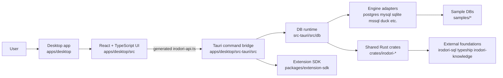
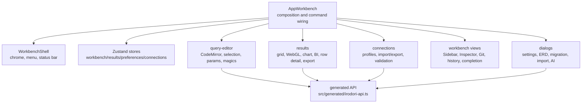
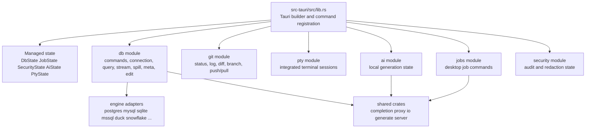
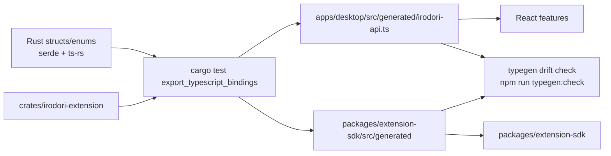
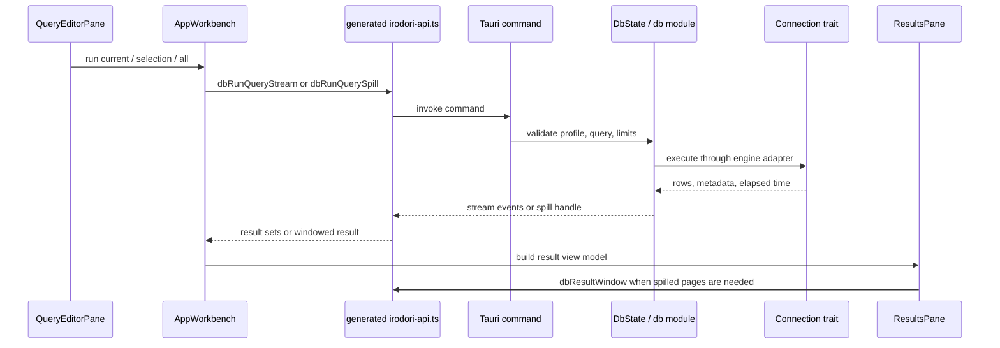
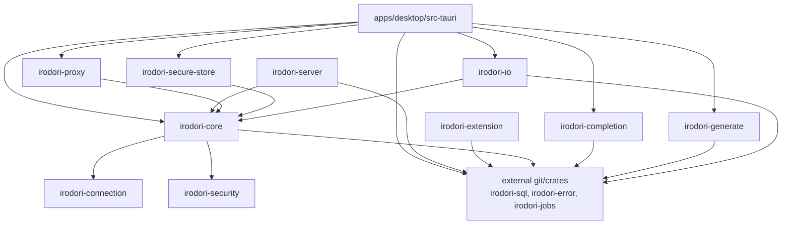
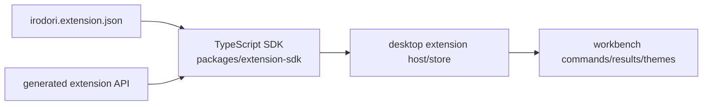

# Implementation Architecture

This document explains the implementation shape of Irodori Table in this
repository. It is intentionally practical: use it to decide which directory owns
a change, how frontend code reaches Rust, and where shared logic should live.

The public mdBook remains the durable product/development documentation. This
repo-local page is the implementation map for contributors working directly in
the code.

## Goals

- Keep the desktop app as the product integration point.
- Keep Rust/TypeScript command payloads generated from Rust definitions.
- Keep shared crates small and earned by stable boundaries.
- Keep database execution, streaming, cancellation, and result paging in Rust.
- Keep UI workflow, layout, and interaction state in the desktop frontend.
- Keep extension contracts separate from app-only implementation details.

## System View



## Repository Ownership

| Path | Owns |
| --- | --- |
| `apps/desktop/src/` | React UI, workbench layout, commands, settings, editor/result interactions, client stores. |
| `apps/desktop/src-tauri/src/` | Tauri command handlers, database sessions, Git, terminal, local AI, security state, background jobs. |
| `crates/irodori-connection/` | Portable connection profile model. |
| `crates/irodori-security/` | Security/audit-facing shared model. |
| `crates/irodori-core/` | Shared core model and composition around connection/security/job foundations. |
| `crates/irodori-completion/` | Metadata-driven completion and inspection logic. |
| `crates/irodori-generate/` | Local SQL generation planning, schema projection, runtime, verification. |
| `crates/irodori-extension/` | Rust definitions for extension API generation. |
| `crates/irodori-io/` | Import/export encoders and tabular data helpers. |
| `crates/irodori-proxy/` | Direct/SSH/proxy transport planning and forwarding. |
| `crates/irodori-secure-store/` | OS secret store integration boundary. |
| `crates/irodori-server/` | Optional local HTTP API/headless surface. |
| `packages/extension-sdk/` | TypeScript SDK and templates for extension authors. |
| `tools/` | Code generation, docs checks, extension validation, security checks. |
| `samples/` | Database fixtures and compose files for manual and integration testing. |

## Frontend Shape

The frontend is feature-first. Cross-feature composition happens in
`apps/desktop/src/app/AppWorkbench.tsx`, while feature behavior should stay in
`apps/desktop/src/features/*`.



Frontend rules of thumb:

- Put user workflow code under the owning `features/<area>/` directory.
- Keep reusable pure SQL helpers under `src/sql/`.
- Keep global keyboard metadata in `src/core/keybindings.ts`.
- Keep command orchestration in `features/workbench/command-handlers.ts`.
- Keep large repeated UI surfaces under feature `components/`.
- Keep cross-feature UI primitives under `src/components/` — currently
  `DialogShell` (shared modal chrome) and `ErrorBoundary`.
- All modals render through `DialogShell`: it owns the scrim overlay,
  ESC-to-close, click-outside, focus trap, focus restoration, and
  `role="dialog"`/`aria-modal`. Do not hand-roll modal overlays.
- Wrap fallible subtrees in `ErrorBoundary` so a render error degrades locally
  instead of white-screening the whole app (the root is wrapped in `App.tsx`).
- Pull cohesive orchestration out of the `AppWorkbench` shell into hooks under
  `src/app/hooks/` (e.g. `useResultGridScroll` / `useResultGridFiltering` /
  `useResultGridSelection`) rather than growing the shell.
- Split multi-tab dialogs into one component per tab (e.g.
  `features/settings/tabs/`); the dialog file stays a thin shell.
- Use the design tokens in `styles/base.css` for spacing, radius, and
  elevation (`--space-*`, `--radius-*`, `--elevation-*`) instead of ad-hoc px,
  and theme color tokens instead of hardcoded colors.
- Add or change Tauri payloads in Rust first, then regenerate TypeScript.

## Backend Shape

Tauri owns local privileged work. The frontend should not know driver details,
secret storage details, or streaming/paging internals.



Backend rules of thumb:

- Add a Tauri command only when the UI needs a privileged/local boundary.
- Keep per-engine driver logic in `src-tauri/src/db/<engine>.rs`.
- Keep engine-independent query splitting, result shaping, streaming, and spill
  behavior in `db/query.rs`, `db/stream.rs`, and `db/spill.rs`.
- Keep metadata conversion in `db/meta.rs`.
- Keep connection profile normalization and redaction in `db/profile.rs`.
- Keep generated command DTOs serializable with `serde(rename_all =
  "camelCase")` and `ts-rs` where they cross to TypeScript.

## Command And Type Boundary

Rust is the source of truth for desktop command payloads. TypeScript consumes
generated bindings rather than hand-writing copies.



Use these commands:

```sh
make desktop-typegen
make desktop-typegen-check
make desktop-build-verified
```

## Query Execution Flow

The query path is intentionally Rust-heavy so large result sets, cancellation,
and disk offload stay bounded.



Important implementation details:

- `db_run_query_stream` streams batches for fast first paint.
- `db_run_query_spill` writes huge results to a bounded Rust-side result store.
- `db_result_window` pages spilled results back into the grid.
- `db_cancel` cancels active work through cancellation tokens.
- The UI result grid handles sorting/filtering/editing for resident results.
- Spilled results are browse-first; server-side sort/filter is a separate
  workflow.

## Shared Crate Layers



Do not add a crate just because a future feature sounds independent. Start
inside the owning app or crate, then split when there is a stable API, separate
test cadence, or a real second consumer.

## Extension Surface

Extensions are intentionally not the same as app internals.



Extension rules:

- Public extension payloads belong in `crates/irodori-extension`.
- SDK convenience wrappers belong in `packages/extension-sdk/src`.
- App-only plugin registry and loading state belongs under
  `apps/desktop/src/features/extensions`.
- Templates must stay permissively licensed and validate through
  `make extension-manifests`.

## Adding A Feature

1. Decide the owner.
   - UI workflow: `apps/desktop/src/features/<area>`.
   - Local privileged action: `apps/desktop/src-tauri/src/<area>`.
   - Stable shared model: an existing crate, not a new crate by default.
2. If TypeScript calls Rust, define or update the Rust DTO/command first.
3. Regenerate bindings with `make desktop-typegen`.
4. Wire the UI through `generated/irodori-api.ts`, not handwritten invoke calls.
5. Add focused unit tests near the owning feature.
6. Run the smallest relevant checks, then broaden if the boundary changed.

Typical checks:

```sh
make desktop-typegen-check
npm --prefix apps/desktop test
npm --prefix apps/desktop run build
cargo test --workspace
```

## Current Refactor Pressure Points

These areas work but should be watched because they are high-change/high-size:

- `apps/desktop/src/app/AppWorkbench.tsx`: integration point. Move feature logic
  into hooks, stores, or feature components when touching it.
- `apps/desktop/src/features/connections/connection-transfer.ts`: importer
  coverage is broad. Keep parsers test-backed.
- `apps/desktop/src/sql/completion.ts`: completion logic should continue moving
  toward `irodori-completion` when it becomes engine-independent.
- `apps/desktop/src/theme/index.ts`: theme normalization should stay data-driven.
- `apps/desktop/src/features/results/components/WebGlResultGrid.tsx`: rendering
  behavior should stay isolated from result model construction.

## Architecture Guardrails

- `apps/desktop` is allowed to orchestrate product UX.
- `crates/*` should not know about React, Tauri windows, or app layout.
- Rust command payloads should use camelCase at the JSON/TS boundary.
- Long-running work should expose progress/cancel/logs through jobs.
- Huge data should stream or spill; do not buffer full result sets in the UI.
- Secret values should not be logged, copied into generated bindings, or stored
  in plain frontend state.
- Reference-project research belongs in docs or requirements, not copied code.
